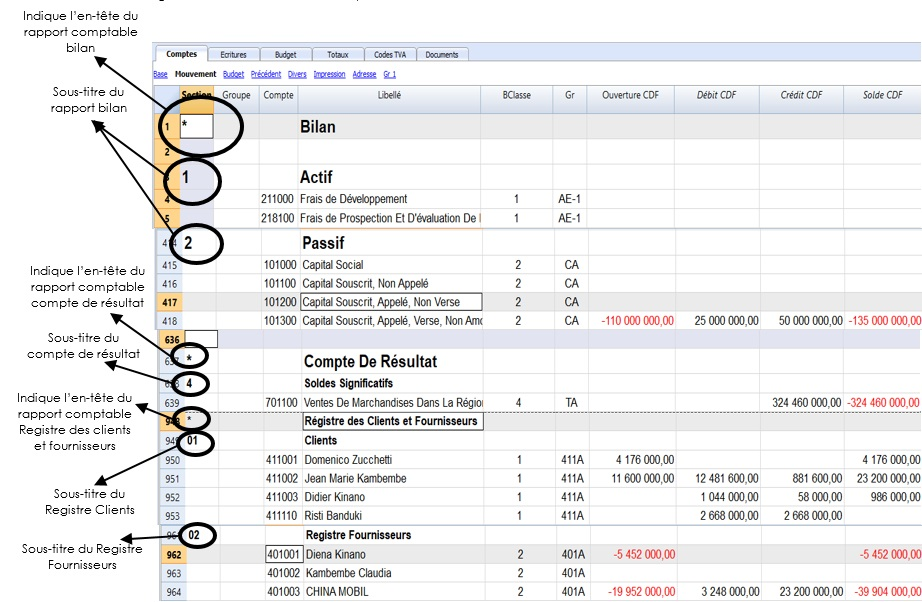

+++
title = "Activité 2"
description = "TEST TEST"
weight = "2"
+++

## Activité 2 : Configuration du plan des comptes

Contenu:

* [A. Fiche Pédagogique](#A-fiche-pédagogique)
    - [1. Objectifs spécifiques](#1-objectifs-spécifiques)
    - [2. Supports](#2-supports)
    - [3. Méthodes et Techniques](#3-méthodes-et-techniques)
    - [4. Durée](#4-durée)
    - [5. Déroulement de l'activité](#5-déroulement-de-l'activité)
* [B. Fiche Technique](#B-fiche-technique)
    - [1. Notions](#1-notions)
    - [2. Différents types des lignes et des sections](#2-différents-types-des-lignes-et-des-sections)
    - [3. Explication des colonnes de la comptabilité en partie double](#3-explication-des-colonnes-de-la-comptabilité-en-partie-double)
    - [4. Configuration du plan de comptes selon le modèle OHADA](#4-configuration-du-plan-de-comptes-selon-le-modèle-OHADA)

    - [5. Procédure du système de totalisation](#5-procédure-du-système-de-totalisation)

    - [6. Ajouter / Renommer](#6-ajouter-/-renommer)

    - [7. Supprimer un compte, un groupe ou une catégorie](#7-supprimer-un-compte-un-groupe-ou-une-catégorie)

### A. **Fiche Pédagogique**

#### 1.  **Objectifs spécifiques** :

Au terme de cette activité, le participant sera capable de (d') :

-   Appliquer les notions de configuration d'un plan de compte en utilisant le logiciel banana comptabilité 9 ;

-   Configurer le système de regroupement et de totalisation ;

-   Utiliser la comptabilité en partie double à l'aide du logiciel banana comptabilité 9.

#### 2.  **Supports** :

-   OHADA, Acte uniforme relatif au droit comptable et à l'information financière et système comptable OHADA, Yaoundé le 15 février 2017 ;

-   Guide d'application OHADA ;

-   EPSP, DIPROMAD, *Curriculum des Humanités Techniques Commerciales*, Commerciale et Gestion, Kinshasa 2014 ;

-   SERNAFOR Technique, module de formation sur le système comptable OHADA niveau 4, 2018 ;

-   [La documentation du logiciel Banana](https://www.banana.ch/fr/documentation)

#### 3.  **Méthodes et techniques** :

Exposé, discussion dirigée, brainstorming et travail de groupe.

#### 4.  **Durée** : 

120 minutes

#### 5.  **Déroulement de l'activité** :

| **N°** | **Tâches**                                                                                                                                                                       | **Méthodes et Techniques** | **Durée** |
| ------ | -------------------------------------------------------------------------------------------------------------------------------------------------------------------------------- | -------------------------- | --------- |
| 1      | Présenter l’activité et ses objectifs                                                                                                                                            | Exposé                     | 5 min     |
| 2      | Expliquer les notions sur la configuration du plan comptable dans le logiciel                                                                                                    | Brainstorming              | 15 min    |
| 3      | Constituer des sous-groupes pour : <ul><li>configurer le système de regroupement et de totalisation ;</li><li>appliquer la comptabilité en partie double à l’aide du logiciel comptable.</li></ul> | Travail en groupe          | 70 min    |
| 4      | En plénière : le rapporteur de chaque sous-groupe présente la production de son équipe suivie de mise en commun avec les membres des autres sous-groupes et du facilitateur.     | Discussion dirigée         | 20 min    |
| 5      | Questions de synthèse<ul><li>Comment configurer le système de regroupement et de totalisation ;</li><li>Expliquer les colonnes de la comptabilité en partiedouble</li></ul>                       | Discussion dirigée         | 10 min    |

### B. **Fiche Technique**

#### 1. Notions

Pendant la présente activité consiste à créer le plan des comptes qui sera ensuite utilisé pour les écritures. La structure du plan comptable permettra d'obtenir en temps réel les États financiers.

Le plan de comptes comprend les colonnes du solde d'ouverture, du mouvement (débit et crédit) et du solde actuel, qui sont ajournés automatiquement par le programme.

#### 2. Différents types des lignes et des sections

Le tableau Comptes (Plan comptable) est à la fois l'outil de
configuration que l'outil pour l'affichage immédiat de la situation économique et financière. Dans le plan comptable, on indique les différents éléments nécessaires pour regrouper les mouvements.

#### 3. Explication des colonnes de la comptabilité en partie double

a. **[Sections](https://www.banana.ch/doc9/fr/node/3384)**: Servent à indiquer les subdivisions du plan de comptes, pour l'impression du Bilan, Compte de Résultat, etc.

Pour marquer la section, il suffit de faire un double clic sur l'une des cellules dans la colonne section afin de sélectionner l'élément de votre choix comme indiqué ci-dessous :

b.  **[Groupes](https://www.banana.ch/doc9/fr/node/3383)**: Sont des lignes de totalisation.

c.  **[Compte](https://www.banana.ch/doc9/fr/node/3978)**: On y insère le numéro de compte.

d.  **Libellé :** Un texte pour indiquer le nom du compte, du groupe ou de la section.

e.  **BClasse :** Indique la nature du compte : 1=Actifs, 2=Passifs, 3=Charges, 4=Produits.

f.  **Gr** : **Totaliser dans la ligne indiquée** : On y indique le code d'un groupe de façon que le programme puisse totaliser cette ligne dans le groupe.

g.  **Solde d'ouverture**: le solde du compte au début de l'année est inséré. Le solde créditeur doit être inséré et précédé par le signe moins (-). Le solde débiteur (en positif). Une différence est indiquée dans la fenêtre d\'information si les soldes d\'ouverture ne sont pas en équilibre, il faut recontrôler la comptabilité (Maj. + F9).

h.  **Mouvement Débit et Crédit**(Colonne protégée) : Le total des mouvements Débit et Crédit sont générés dans le tableau d'écritures.

i.  **Solde (Colonne protégée)** : Le solde du compte inclut le solde d'ouverture et les mouvements Débit et Crédit. Le solde Débiteur est indiqué en positif ; le solde Créditeur est indiqué en négatif (précédé par le signe moins [-]).

j.  **Année précédente**: Le solde du compte à la fin de l'année précédente. Avec les commandes « Créer Nouvelle année » ou « Mettre à jour soldes d'ouverture », les valeurs présentes dans la colonne Solde du fichier de l'année précédente sont reprises. Si une nouvelle comptabilité a été créée et on désire avoir des impressions avec les montants de l'année précédente, les valeurs de l'année précédente doivent être insérées manuellement.

k.  **Colonnes adresses**: Le programme peut [ajouter des colonnes pour les adresses](https://www.banana.ch/doc9/fr/node/4846#colonnes), pour la gestion des données des clients ou des fournisseurs.

Le plan des comptes offre ainsi une vision immédiate et complète de votre situation financière à travers : le bilan, le compte de Résultat, le registre clients et fournisseurs.

#### 4. Configuration du plan de comptes selon le modèle OHADA

En ce qui concerne la configuration du plan de comptes OHADA, nous nous référons aux structures des tableaux de correspondance postes/comptes, le plan de comptes OHADA, le plan de comptes général OHADA ainsi qu'aux modèles des Etats financiers (bilan, compte de résultats, tableau de flux de trésorerie) ci-après :

 
 
 

 
 
 

 
 
 

 
 
 

 
 
 

 
 
 

##### 4.1 Les groupes du plan de comptes OHADA

Il sied de signaler que les références des tableaux de correspondance constituent les groupes qui servent à la configuration du plan de comptes OHADA.

##### 4.1.1 Configuration de l'actif du bilan

En nous référent au groupe **AE**, suivant le modèle du tableau de correspondance et du bilan ci-dessous :

Désignons :

-   Brut par **AE-1.**

-   Amortissement/Dépréciation par **AE-2** ;

-   Net par **AE**

Donc, le Net (AE) = Brut (AE-1) -- Amort/Dép (AE-2) : disposition
horizontale (voir modèle bilan)

**N.B.** : La configuration du plan de comptes modèle OHADA sous le logiciel Banana suit la disposition verticale telle qu'indiquée dans la formule ci-haut.

Le tableau ci-dessous indique en quelques lignes, la configuration de l'actif du bilan du plan de comptes selon le modèle OHADA.

**Extrait du plan de comptes selon le modèle OHADA (actif)**

|     Section    |     Groupe    |     Compte                                      |     Libellé                                                                             |     BClasse    |     Gr      |     Ouverture     CDF    |     Débit     CDF    |     Crédit     CDF    |     Solde     CDF    |     Précédente     CDF    |
|----------------|---------------|-------------------------------------------------|-----------------------------------------------------------------------------------------|----------------|-------------|--------------------------|----------------------|-----------------------|----------------------|---------------------------|
|     *          |               |                                                 |     Bilan                                                                               |                |             |                          |                      |                       |                      |                           |
|     1          |               |                                                 |     Actif                                                                               |                |             |                          |                      |                       |                      |                           |
|                |               |                      211000                     | Frais de Développement                                                                  | 1              | AE-1        |                          |                      |                       |                      |                           |
|                |               |     218100                                      |     Frais de Prospection Et   D'évaluation De Ressources Minérales                      |     1          |     AE-1    |                          |                      |                       |                      |                           |
|                |               |     219100                                      |     Frais de Recherche Et   De Développement                                            |     1          |     AE-1    |                          |                      |                       |                      |                           |
|                |     AE-1      |                                                 |     Frais de   Développement et de Prospection Brut                                     |                |     AE      |                          |                      |                       |                      |                           |
|                |               |     281100                                      |     Amortissement   Des Frais De Développent                                            |     1          |     AE-2    |                          |                      |                       |                      |                           |
|                |               |     291100                                      |     Dépréciations   Des Frais De Développement                                          |     1          |     AE-2    |                          |                      |                       |                      |                           |
|                |     AE-2      |                                                 |     Amort   & Dépréciation des Frais De Développement                                   |                |     AE      |                          |                      |                       |                      |                           |
|                |     AE        |                                                 |     Frais De Développement   et de Prospection Net                                      |                |     AD      |                          |                      |                       |                      |                           |
|                |     AF-1      |                                                 |     Brevets,   Licences, Concessions Et Droits Similaires                               |                |     AF      |                          |                      |                       |                      |                           |
|                |     AF-2      |                                                 |     Amort.   & Dépréciations Des Brevets, Licences, Concessions Et Droits Similaires    |                |     AF      |                          |                      |                       |                      |                           |
|                |     AF        |                                                 |     Brevets,   Licences, Concessions Et Droits Similaires Net                           |                |     AD      |                          |                      |                       |                      |                           |
|                |     AG-1      |                                                 |     Fonds   Commercial Et Droit Au Bail                                                 |                |     AG      |                          |                      |                       |                      |                           |
|                |     AG-2      |                                                 |     Amortissement   / Dépréciation Des Fonds Commercial                                 |                |     AG      |                          |                      |                       |                      |                           |
|                |     AG        |                                                 |     Fonds   Commercial Et Droit Au Bail Net                                             |                |     AD      |                          |                      |                       |                      |                           |
|                |     AH-1      |                                                 |     Autres   Immobilisations Incorporelles Brut                                         |                |     AH      |                          |                      |                       |                      |                           |
|                |     AH-2      |                                                 |     Dépréciations/   Amortissement Des Autres Immobilisations Incorporelles             |                |     AH      |                          |                      |                       |                      |                           |
|                |     AH        |                                                 |     Autres   Immobilisations Incorporelles Net                                          |                |     AD      |                          |                      |                       |                      |                           |
|                |     AD        |                                                 |     Immobilisation   Incorporelles Net                                                  |                |     AZ      |                          |                      |                       |                      |                           |

La logique ci-dessus doit être utilisée pour tous les groupes de l'actif à l'exception du groupe BU

##### 4.1.2 Configuration du passif du bilan

La configuration du passif est simple et pratique. Il est question de suivre les références du tableau de correspondance.

**Extrait du plan de comptes selon le modèle OHADA (passif)**

|     Section    |     Groupe    |     Compte    |     Libellé                           |     BClasse    |     Gr    |     Ouverture     CDF    |     Débit     CDF    |     Crédit     CDF    |     Solde     CDF    |     Précédente     CDF    |
|----------------|---------------|---------------|---------------------------------------|----------------|-----------|--------------------------|----------------------|-----------------------|----------------------|---------------------------|
|     2          |               |               |     Passif                            |                |           |                          |                      |                       |                      |                           |
|                |               |     101000    |     Capital   Social                  |     2          |     CA    |                          |                      |                       |                      |                           |
|                |               |     101100    |     Capital   Souscrit, Non Appelé    |     2          |     CA    |                          |                      |                       |                      |                           |
|                |     CA        |               |     Capital                           |                |     CP    |                          |                      |                       |                      |                           |

La logique ci-dessus doit être utilisée pour le reste des groupes du passif.

##### 4.1.3 Configuration du compte de résultat

La configuration du compte de résultat est simple et pratique. Il est question de suivre les références du tableau de correspondance.

**Extrait du compte de résultat selon le modèle OHADA**

|     Section    |     Groupe    |     Compte    |     Libellé                                       |     BClasse    |     Gr     |     Ouverture     CDF    |     Débit     CDF    |     Crédit     CDF    |     Solde     CDF    |     Précédente     CDF    |
|----------------|---------------|---------------|---------------------------------------------------|----------------|------------|--------------------------|----------------------|-----------------------|----------------------|---------------------------|
|     *          |               |               |     Compte De Résultat                            |                |            |                          |                      |                       |                      |                           |
|     4          |               |               |     Soldes   significatifs                        |                |            |                          |                      |                       |                      |                           |
|                |               |     701100    |     Ventes De Marchandises Dans La Région         |     4          |     TA     |                          |                      |                       |                      |                           |
|                |               |     701900    |     Rabais, Remises, Ristournes Accordes          |     4          |     TA     |                          |                      |                       |                      |                           |
|                |     TA        |               |     Ventes De Marchandises                        |                |     132    |                          |                      |                       |                      |                           |
|                |               |     601100    |     Achats De Marchandises Dans La Région         |     3          |     RA     |                          |                      |                       |                      |                           |
|                |               |     601510    |     Frais de Transports sur achat Marchandises    |     3          |     RA     |                          |                      |                       |                      |                           |
|                |     RA        |               |     Achats De Marchandises                        |                |     132    |                          |                      |                       |                      |                           |

La logique ci-dessus doit être utilisée pour le reste des groupes du compte de résultat.

Pour avoir le plan de comptes modèle OHADA complet, prière de le
télécharger au lien :
<https://www.banana.ch/apps/fr?combine=&langcode=All&country=307>

**Observations**: Il convient de souligner que les groupes en bleu ne font pas partie des références du tableau de correspondance de postes/comptes OHADA mais sont des groupes intermédiaires servant pour l'élaboration automatique du tableau de flux de trésorerie.

#### 5. Procédure du système de totalisation

Le système de totalisation est très flexible :

-   Dans un groupe, il est possible d\'additionner autant des comptes que des groupes

|     Section    |     Groupe    |     Compte    |     Libellé                                                           |     BClasse    |     Gr      |     Ouverture     CDF    |     Débit     CDF    |     Crédit     CDF    |     Solde     CDF    |     Précédente     CDF    |
|----------------|---------------|---------------|-----------------------------------------------------------------------|----------------|-------------|--------------------------|----------------------|-----------------------|----------------------|---------------------------|
|     *          |               |               |     Bilan                                                             |                |             |                          |                      |                       |                      |                           |
|     1          |               |               |     Actif                                                             |                |             |                          |                      |                       |                      |                           |
|                |               |     211000    |     Frais de Développement                                            |     1          |     AE-1    |                          |                      |                       |                      |                           |
|                |               |     218100    |     Frais de Prospection Et   D'évaluation De Ressources Minérales    |     1          |     AE-1    |                          |                      |                       |                      |                           |
|                |               |     219100    |     Frais de Recherche Et   De Développement                          |     1          |     AE-1    |                          |                      |                       |                      |                           |
|                |     AE-1      |               |     Frais de   Développement et de Prospection Brut                   |                |     AE      |                          |                      |                       |                      |                           |
|                |               |     281100    |     Amortissement   Des Frais De Développent                          |     1          |     AE-2    |                          |                      |                       |                      |                           |
|                |               |     291100    |     Dépréciations   Des Frais De Développement                        |     1          |     AE-2    |                          |                      |                       |                      |                           |
|                |     AE-2      |               |     Amort   & Dépréciation des Frais De Développement                 |                |     AE      |                          |                      |                       |                      |                           |
|                |     AE        |               |     Frais De   Développement et de Prospection Net                    |                |     AD      |                          |                      |                       |                      |                           |

-   Les comptes (211000, 218100 et 219100) sont additionnés dans le groupe AE-1 et les comptes (281100 et 291100) sont additionnés dans le groupe AE-2 et ces deux groupes sont additionnés dans le groupe AE

-   On peut utiliser n\'importe quel genre de numérotation

-   On peut créer jusqu\'à 100 niveaux de totalisation

-   La totalisation est indépendante de la séquence : 

    -   La ligne de total peut être positionnée après la ligne

    -   La ligne de total peut être positionnée avant la ligne

    -   La ligne de total peut être positionnée dans une position
        complètement détachée ; ceci sert à créer des registres.

-   Le compte et les Groupes peuvent être totalisés dans un seul autre Groupe. Le même compte ne peut être totalisé simultanément dans deux Groupes.

#### 5.1 Totalisation des colonnes Montant

La procédure de calcul additionne les colonnes Type Montant :

-   Sont totalisées les colonnes Montant définies par le système ;

-   Sont totalisées les colonnes Montant ajoutées par l'utilisateur.

#### 5.2 La séquence de Calcul

Le programme calcule les totaux comme suit :

-   Remet à zéro les valeurs des colonnes Montant des lignes de Groupe ;

-   Additionne les montants des lignes des Comptes dans les lignes de Groupe (premier niveau de calcul).

-   Additionne le solde des lignes des Groupes dans les Groupes de niveau supérieur. Il convient de Répéter l'opération jusqu'à ce que tous les niveaux soient calculés

#### 6. Ajouter / Renommer

#### 6.1 Ajouter un nouveau compte ou catégorie

-   Se positionner dans la ligne précédente à celle où le nouveau compte ou catégorie sera inséré ;

-   Ajouter une ligne avec la commande **Édition ->**[Ajouter  lignes](https://www.banana.ch/doc9/fr/node/2848#1) ;

-   Dans les colonnes respectives, insérer le numéro de compte, le libellé, la B classe (1 pour les Actifs, 2 pour les Passifs, 3 pour les charges, et 4 pour les Produits), le numéro de **Gr** qui doit être égal à celui qui a été inséré pour les comptes qui appartiennent au même Groupe.

**Attention** : Si on insère une écriture avec un compte inexistant, un message d\'erreur apparaît (compte non trouvé). Pour corriger l'erreur, ajouter ce compte dans le plan de compte. Il est nécessaire de recontrôler la comptabilité avec la touche **Maj. + F9**, ou à partir du menu **Compta1**, commande [Recontrôler comptabilité](https://www.banana.ch/doc9/fr/node/3973).

#### 6.2 Ajouter un nouveau groupe

-   Se positionner dans la ligne précédente à celle où le nouveau groupe sera inséré ;

-   Ajouter une ligne avec la commande **Édition ->**[Ajouter lignes](https://www.banana.ch/doc9/fr/node/2848#1) ;

-   Dans la colonne Groupe, insérer le numéro de groupe, le libellé et le numéro de Gr où l'on désire que ce groupe soit totalisé.

#### 6.3 Renommer un compte ou un groupe

-   Se positionner sur la colonne **Compte** ou **Groupe** du tableau **Comptes**, ou sur la colonne **Catégories** du tableau **Catégories** (ou sur la colonne **Code TVA** du tableau **Codes TVA**) ;

-   Cliquer sur la commande **Données ->** [Renommer](https://www.banana.ch/doc9/fr/node/3008) ;

-   Indiquer le nouveau numéro de compte ou de groupe, de catégorie ou le nouveau Code TVA.

Le programme met automatiquement le tableau **Écritures** à jour avec le nouveau numéro ou code.

#### 7. Supprimer un compte, un groupe ou une catégorie

-   Se positionner sur la ligne que l'on veut éliminer

-   Donner la commande **Édition** -> **Supprimer lignes**

-   Confirmer le nombre de lignes que l'on veut éliminer

Après avoir éliminé un compte, un groupe, ou une catégorie, il est nécessaire de recontrôler la comptabilité (touche **Maj.+F9**, ou à partir du menu **Compta1**, commande [Recontrôler comptabilité](https://www.banana.ch/doc9/fr/node/3973)). Le programme signale si le compte, le groupe ou la catégorie qui a été éliminé était utilisé dans les écritures.

